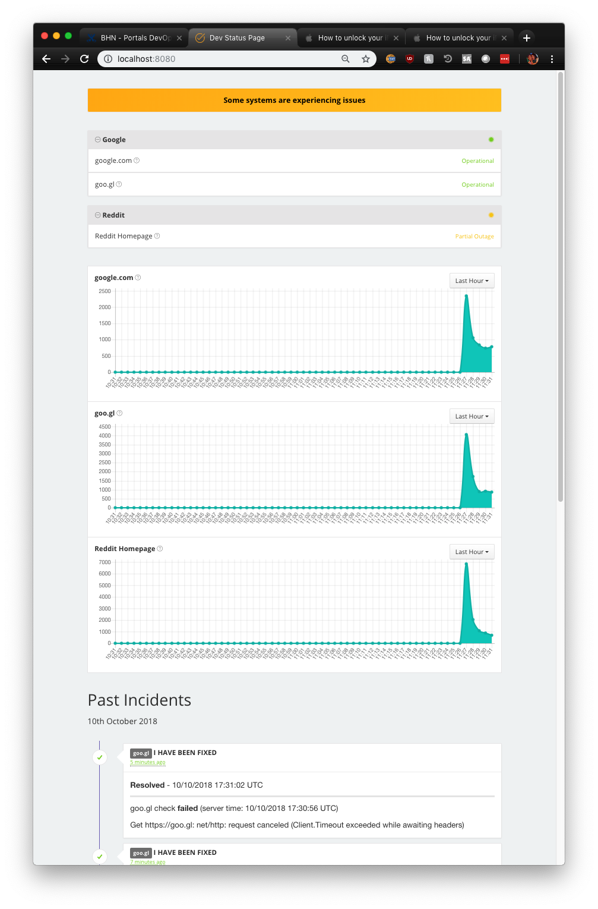

# Status Page

## Notes

This provides a way to fully automate the deployment of [Cachet](https://cachethq.io/) as well as a monitor. 

This will probably not work once Cachet is updated to [2.4](https://github.com/CachetHQ/Cachet/tree/2.4) but right now it will work around all bugs as well as skip past any setup. You can run this and a fully functional status page.

It also provides methods for running them on either VMs or Containers

For reasons, this [Ansible](https://www.ansible.com/) was written for [CentOS 7](https://www.centos.org/). [Vagrant](https://www.vagrantup.com/) and [Docker](https://www.docker.com/) will take care of getting the correct OS. 

The monitor uses [cachet-monitor](https://github.com/CastawayLabs/cachet-monitor).

## Overview

### Description
Cachet is an open source, community maintained status board application. It allows for a user to easily view statuses, metrics, and incidents. While Cachet runs on a server, items can be updated via the dashboard or through API calls.

Cachet has three main items: 

#### Components
> Components are entries in cachet that can have a status. The statuses are Operational, Performance Issues, Partial Outage, and Major Outage. These statuses will appear on the main page. It should be mentioned that cachet refers to the backend page as the dashboard. Components can be organized it to collapsable components groups.

#### Metrics
> Metrics displayed via a graph. The display graph can display sums or averages. There is some ambiguity as to how these functions work and further testing and experimentation is needed since the documentation for cachet is quite limited. 

#### Incidents
> Incidents log when there has been an issue. Incidents have four available statuses. The statuses are Investigating, Identified, Watching, and Fixed. They can also include the related component (with an ability to update the component status), a message, visibility, and a timestamp. More testing and experimentation needs to be done with incidents. It's worth noting that incidents can have templates with scripted output using twig. Subscribers would presumably get email notifications when an incident occurs. 

Cachet has several 3rd party plugins that make it easier to send API calls. The current version of the status page project uses cachet-monitor. While future plans include our own custom application to send data to the cachet server, this plugin serves as a good temporary utility.

The plugin cachet monitor can: 

- Check a URL for an expected response (Includes response code or pattern matching on response body) and check the response time for that request. 
- If the response code is invalid, cachet-monitor will continue checking and calculate a %Downtime.
- If the downtime exceeds a set threshold, it will then update the component status and create an issue. It will create a resolution incident as well once uptime is above the threshold
- It will then send all this data to cachet server via an API call
- It is worth noting that entries can be made directly into the database rather than API calls. This is not an officially supported method, but it is possible and may be a future avenue that we use to send data to the server. 

The current default login info for Cachet is admin/password.

---

### Interface



#### Installation

##### Overview

As of version 1.0 (Commutative Algebra) there are two ways to deploy *Cachet* and *Cachet-Monitor*. These are *Vagrant* and *Docker*. There is a separate Vagrantfile and Dockerfile for both Cachet and Cachet monitor. 

The Dockerfile and Vagrantfile configure network settings so that Cachet and Cachet-Monitor can communicate. The connection info for each should be as follows:

|  | Cachet | Cachet-Monitor |
|---|:---:|:---:|
| Vagrant | 10.0.0.10 | 10.0.0.11 |
| Docker  | 172.17.0.2 | 172.17.0.3 |

Vagrant has the following port forwards configured:

|  | Guest | Host |
|---|:---|:---:|
| Cachet | 80 | 8080 |
| Cachet | 443 | 8443 |
| Cachet-Monitor | 80 | 8081 | 
| Cachet-Monitor | 443 | 8444

Cachet and Cachet-Monitor are provisioned with Ansible. In theory, you should be able to clone the rep and run the status\_page.yml and/or cachet\_monitor.yml playbooks on a system without having to user Docker or Vagrant. 

Prerequisites

- Access to stash to be able to clone the status\_page repo
- Git to be able to clone the status_page repo
- A Unix based system (Linux or Mac)*
- Vagrant
- Docker

\* *This has not been tested with Windows*

#### Vagrant

There is a makefile located in each vagrant directory. Using this makefile will decrease the amount of time you are stuck waiting by an order of magnitude.

It is so effective that it is the only current supported method for this project. Just running vagrant up will be ineffective due to run tags in the vagrant file\*.

Commands you can run from the ansible/vagrant/cachet or ansible/vagrant/cachet\_monitor directory. 

`make clean`

> Destroys vagrant box

`make base`

> Creates a backup snapshot
> Destroys running vagrant vm
> Creates a new blank vm
> Runs the general provisioner
> Runs the base ansible provisioner
> Creates a 'base' snapshot

`make core`

> Creates a backup snapshot
> Restores to the 'base' snapshot
> Runs the provisioners and 'base ansible'
> Creates a 'core' snapshot

`make setup`

> Creates a backup snapshot
> Restores to the 'core' snapshot
> Runs the provisioners
> Ansible excludes the base and core tags

`make all`

> Runs 'base', 'core', 'setup'

`make restore`

> Presents a list of available snapshots that you can restore from
Access

You should then be able to access cachet by navigating to http://localhost:8080

There is also a script located in ansible/vagrant named vagrant\_build\_all.sh . This script will run 'make all' for both Cachet and Cachet-Monitor.

\*This may change in the future.

---

#### Docker

There is a script in the root directory of the repo named docker\_build\_all.sh .This script with download a necessary git repo, build both container images, and run each container. 

If you decide not to run the script, follow these steps to build the docker containers. (Requires [docker-systemctl-replacement](https://github.com/gdraheim/docker-systemctl-replacement/blob/master/requirements.txt))

1. Get required repos
	1. Change directory to docker/files
	2. `git clone https://github.com/gdraheim/docker-systemctl-replacement.git`
2. Change back to the root directory of the project
3. Build Cachet docker image
	1. `docker build --rm -f docker/cachet/Dockerfile -t local/cachet .`
4. Run Cachet container
	1. `docker run --name cachet -e container=docker -d -p 8080:80 local/cachet /bin/bash -c "systemctl default" --link`
5. Build Cachet-Monitor docker image
	1. `docker build --rm -f docker/cachet-monitor/Dockerfile -t local/cachet-monitor .`
6. Run Cachet-Monitor container
	1. `docker run --name cachet-monitor -e container=docker -d -p 8081:80 local/cachet-monitor /bin/bash -c "systemctl default" --link`

If you need to get a bash shell for either container: 

- Cachet `docker exec -ti cachet /bin/bash`
- Cachet-Monitor `docker exec -ti cachet_monitor /bin/bash`

---

### Configuration

#### Cachet

The status page repo includes code that automatically configures cachet. Current plans include a way to easily toggle this auto configuration. It should be a matter of just modifying the ansible to not include the cachet_components.yml

If you do an install just using the tags "core" and "base", you will then be able to configure the system by going to http://cachetserverhostname/setup

This setup will ask several basic questions as well as some about the underlying side. In the unlikely event that you should reach that page, the answers are "memcached" for the driver and the database is postgresql. 

To modify the components that are added to Cachet, edit the file ansible/roles/internal/status\_page/tasks/cachet\_components.yml and modify the "Set global facts for the components and metrics" task. The format currently being used is: 

```
envs:
- name: <Component Group Name>
  group_id: <Unique ID for each Component Group>
  sites:
	- name: <Component Name>
  	  address: <Component Address>
      id: <Unique ID for each Component>
...
...
```

#### Cachet-Monitor

Cachet-Monitor is meant to be a distributed monitoring plugin. Meaning that several different servers can run the monitor with each passing info back to the Cachet server. Because of this, there are multiple cachet-monitor configuration files. Which file is used is determined by the "env" variable that is passed to ansible when running the cachet_monitor playbook. This can also be set up in the file ansible/roles/internal/cachet\_monitor/defaults/main.yml

See the example-config.yml in the Cachet-Monitor repo for an example config. 

When the Cachet-Monitor playbook is run, ansible will try to contact the Cachet server using the ansible variable {{ cachet_hostname }}. The Vagrantfile and Dockerfile for Cachet-Monitor pass this variable when calling the playbook. It does this in order to pull the Admin API Key from Cachet via cURL. Ansible will show an error (it will not exit) if this is the case with the consequence being that Cachet-Monitor will not be able to update components, metrics, and incidents on the Cachet server. 

The Admin API Key can be found by logging into the Cachet dashboard and clicking on the icon in the top left of the page. If you need to manually set that key on the system running Cachet-Monitor, edit the file /etc/cachet-monitor.config.yml and put the key in the 'token' field. Then restart cachet monitor by running 'sudo systemctl restart cachet-monitor.service' or 'sudo systemctl restart cachet-monitor'

The logfile for Cachet-Monitor is /var/log/cachet-monitor.log

---

### Usage
Simply navigate in a web browser to the address of the cachet server. 

Future Considerations
Plans include to create our own plugin, however, a basic status page can easily be configured using Cachet-Monitor

Orchestration still needs to be done. 

---

## Nameing Convention

Versions lower that 1.0 will not be publically available. 

[mathematical focus]

| Ver | Codename |
|-----|:---------|
| 0.1 | Abstract Algebra |
| 0.2 | Abstract Groups |
| 0.3 | Algebraic Geometry |
| 0.4 | Algebraic Topology |
| 0.5 | Analytic Geometry |
| 0.6 | Automorphic Forms |
| 0.7 | Arithmatic |
| 0.8 | Category Theory |
| 0.9 | Classical Analysis |
| 1.0 | Commutative Algebra |
| TBD | Commutative Analysis |
| TBD | Commutative Harmonics |
| TBD | Differential Equations |
| TBD | Differential Geometry |
| TBD | Differential Manifolds |
| TBD | Differential Topology |
| TBD | Ergodic Theory |
| TBD | Fractal Geometry |
| TBD | General Algebra |
| TBD | General Topology |
| TBD | Harmonic Analysis |
| TBD | Homological Algebra |
| TBD | Integration |
| TBD | Lie Groups |
| TBD | Mathematical Logic |
| TBD | Modular Forms |
| TBD | Number Theory |
| TBD | Presheaf |
| TBD | Probability Theory |
| TBD | Set Theory |
| TBD | Spectral Theory |
| TBD | Topological Vector Spaces |
| TBD | Vonneumann Algebras |

I acknowledge it's completely unnessicary but I still wanted to do it.

---

## Author

Joan Bohlman. DevOps by day, Professional Wrestler by night. 